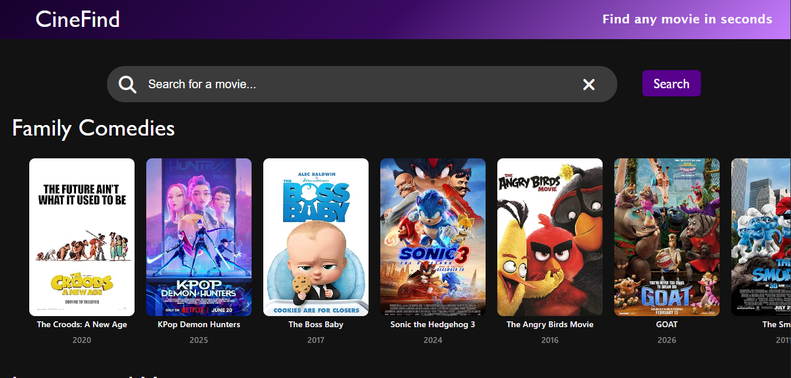
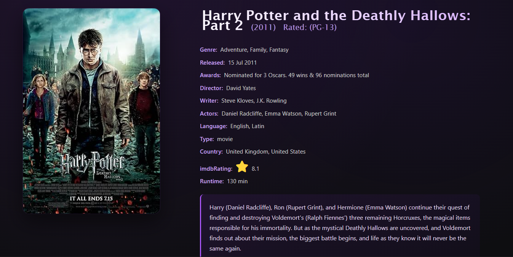

# 🎬 CineFind

A movie search app built with React — search any movie, browse curated genre rows, and click into a full details page with cast, plot, ratings, and recommendations. Built as a personal project to strengthen my React fundamentals, API integration, and routing skills.


## ✨ Features

- **Search any movie** by title using the OMDb API, with multiple matching results shown per search
- **Search history** — recent searches are saved (via localStorage) and shown in a dropdown; click one to search again instantly, remove individual entries, or clear all
- **Curated homepage** — genre-based rows (Family Comedies, Action, Horror, International, Hollywood) shown by default when no search is active
- **Horizontally scrollable rows** for each genre, styled like a streaming platform
- **Movie details page** — click any poster to open a dedicated page with genre, director, writer, cast, language, country, awards, runtime, IMDb rating, and full plot
- **"You Might Also Like"** — recommends other movies based on a mix of the current movie's genres
- **Skeleton loading animations** — shimmer placeholders shown while the homepage, search results, or details page are loading, so the app never shows a blank screen
- **"Not found" state** — clear message shown when a search returns no results
- **Reset to homepage** — clicking the logo returns to the default homepage view
- **Client-side routing** with React Router — navigating between the search page and a movie's details page without a full page reload

## 🛠️ Built With

- **React** (Vite)
- **React Router** — client-side routing for the details page
- **JavaScript (ES6+)**
- **CSS3** (Flexbox, Grid, gradients, animations)
- **OMDb API** — movie data and posters
- **Font Awesome** — icons
- **localStorage** — persisting search history across sessions

## 📸 Screenshots





## 📂 Project Structure

```
src/
  components/
    Navbar.jsx             # Site header/logo, returns to homepage on click
    SearchBar.jsx          # Search input, search history dropdown, clear/reset
    MovieCard.jsx          # Displays a single movie's poster, title, year; links to its details page
    MovieGrid.jsx          # Renders a scrollable row of MovieCards
    SkeletonCard.jsx       # Shimmer placeholder shown while a card's data is loading
    DefaultMovies.jsx      # Fetches and displays curated genre rows on the homepage
    MovieSearchPage.jsx    # Main page — manages search state and switches between views
    MovieDetails.jsx       # Full details page for a single movie, plus recommendations
  App.jsx
  main.jsx
```

## 🎯 What I Learned

- Fetching and handling data from a third-party REST API.
- Managing state across multiple components with props
- Client-side routing with React Router — dynamic route params, programmatic navigation
- Persisting data across sessions with localStorage (search history)
- Handling edge cases: missing/incomplete data, broken images, empty search results, duplicate results across multiple API calls
- Building reusable, prop-driven components (`MovieCard`, `MovieGrid`, `SkeletonCard`)
- Building skeleton/shimmer loading states for a smoother perceived experience
- CSS techniques for responsive grids, horizontal scroll containers, gradients, and hover animations
- Structuring a React project the way it's done in real-world development


## 📄 License

This project is for personal purposes.

## 🙋‍♀️ Author

**Ashlesha Meshram**
GitHub: [@ashleshameshram](https://github.com/ashleshameshram)
